oi# Design Document: Advanced UI Enhancement

## Overview

The Advanced UI Enhancement feature transforms AutoSphere Web into a sophisticated, modern automotive platform through strategic visual design improvements. This enhancement leverages contemporary automotive industry design trends, implementing a professional grey, white, and black color scheme that reflects the premium nature of automotive services while maintaining excellent usability and accessibility.

The design focuses on creating visual hierarchy through strategic use of typography, spacing, and color contrast, while incorporating high-quality automotive imagery and smooth interactive elements. The enhancement covers the landing page, all dashboard interfaces, and introduces a comprehensive footer component, ensuring a cohesive and professional user experience across all touchpoints.

## Architecture

### Design System Architecture

```mermaid
graph TB
    subgraph "Visual Design System"
        A[Color Palette]
        B[Typography Scale]
        C[Spacing System]
        D[Component Library]
    end
    
    subgraph "Enhanced Components"
        E[Landing Page]
        F[User Dashboard]
        G[Admin Dashboard]
        H[Dealer Dashboard]
        I[Service Provider Dashboard]
        J[Footer Component]
    end
    
    subgraph "Supporting Elements"
        K[Image Assets]
        L[Icon System]
        M[Animation Library]
        N[Responsive Breakpoints]
    end
    
    A --> E
    A --> F
    A --> G
    A --> H
    A --> I
    A --> J
    
    B --> E
    B --> F
    B --> G
    B --> H
    B --> I
    B --> J
    
    C --> E
    C --> F
    C --> G
    C --> H
    C --> I
    C --> J
    
    D --> E
    D --> F
    D --> G
    D --> H
    D --> I
    D --> J
    
    K --> E
    K --> F
    K --> G
    K --> H
    K --> I
    
    L --> E
    L --> F
    L --> G
    L --> H
    L --> I
    L --> J
    
    M --> E
    M --> F
    M --> G
    M --> H
    M --> I
    M --> J
    
    N --> E
    N --> F
    N --> G
    N --> H
    N --> I
    N --> J
```



### Technology Stack

**Frontend Enhancements:**
- CSS Custom Properties for consistent theming
- CSS Grid and Flexbox for advanced layouts
- CSS Animations and Transitions for smooth interactions
- Intersection Observer API for scroll-triggered animations
- CSS Container Queries for responsive component design

**Image Optimization:**
- WebP format with fallbacks for optimal loading
- Responsive image sets with srcset attributes
- Lazy loading for performance optimization
- Image compression and optimization pipeline

**Performance Considerations:**
- Critical CSS inlining for above-the-fold content
- CSS and JavaScript code splitting
- Progressive enhancement for animations
- Preloading of critical assets

## Components and Interfaces

### Enhanced Color System

#### Primary Color Palette
```css
:root {
  /* Primary Greys */
  --autosphere-black: #000000;
  --autosphere-charcoal: #1a1a1a;
  --autosphere-dark-grey: #2c2c2c;
  --autosphere-medium-grey: #666666;
  --autosphere-light-grey: #999999;
  --autosphere-silver: #cccccc;
  --autosphere-platinum: #e6e6e6;
  --autosphere-white: #ffffff;
  
  /* Accent Colors */
  --autosphere-accent-blue: #0066cc;
  --autosphere-accent-green: #00cc66;
  --autosphere-accent-red: #cc0000;
  --autosphere-accent-orange: #ff6600;
  
  /* Semantic Colors */
  --autosphere-success: #00cc66;
  --autosphere-warning: #ff6600;
  --autosphere-error: #cc0000;
  --autosphere-info: #0066cc;
}
```

#### Color Usage Guidelines
- **Primary Actions**: Dark grey (#2c2c2c) backgrounds with white text
- **Secondary Actions**: Light grey borders with dark grey text
- **Background Sections**: Alternating white and platinum (#e6e6e6)
- **Text Hierarchy**: Black for headings, dark grey for body, medium grey for secondary
- **Interactive States**: Subtle grey variations for hover and focus states

### Enhanced Typography System

#### Font Hierarchy
```css
:root {
  /* Font Families */
  --font-primary: 'Inter', -apple-system, BlinkMacSystemFont, 'Segoe UI', sans-serif;
  --font-display: 'Inter', -apple-system, BlinkMacSystemFont, 'Segoe UI', sans-serif;
  --font-mono: 'JetBrains Mono', 'Fira Code', monospace;
  
  /* Font Weights */
  --weight-light: 300;
  --weight-regular: 400;
  --weight-medium: 500;
  --weight-semibold: 600;
  --weight-bold: 700;
  
  /* Font Sizes */
  --text-xs: 0.75rem;    /* 12px */
  --text-sm: 0.875rem;   /* 14px */
  --text-base: 1rem;     /* 16px */
  --text-lg: 1.125rem;   /* 18px */
  --text-xl: 1.25rem;    /* 20px */
  --text-2xl: 1.5rem;    /* 24px */
  --text-3xl: 1.875rem;  /* 30px */
  --text-4xl: 2.25rem;   /* 36px */
  --text-5xl: 3rem;      /* 48px */
  --text-6xl: 3.75rem;   /* 60px */
  
  /* Line Heights */
  --leading-tight: 1.25;
  --leading-snug: 1.375;
  --leading-normal: 1.5;
  --leading-relaxed: 1.625;
  --leading-loose: 2;
}
```

### Enhanced Spacing System

#### Spacing Scale
```css
:root {
  /* Spacing Scale */
  --space-1: 0.25rem;   /* 4px */
  --space-2: 0.5rem;    /* 8px