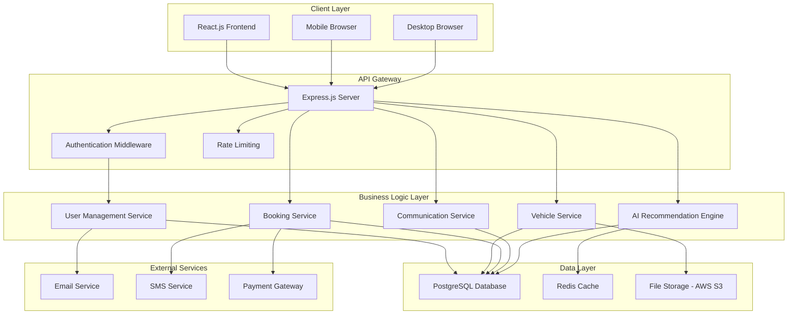
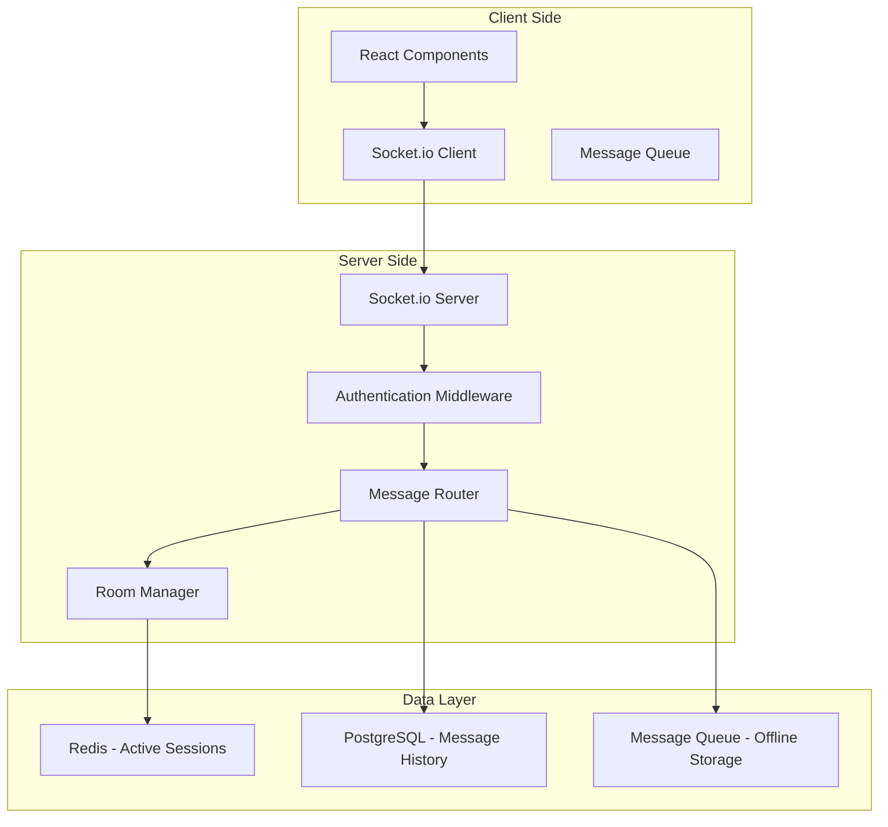
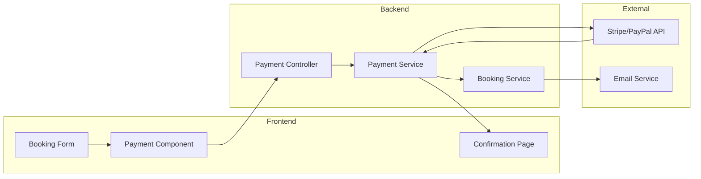

# Design Document: AutoSphere Web

## Overview

AutoSphere Web is a comprehensive automotive platform that integrates vehicle sales, rentals, maintenance booking, and car wash services into a unified web application. The system leverages AI-powered recommendations to enhance user decision-making and provides seamless communication between customers, dealers, and service providers.

The architecture follows modern web development practices with a React.js frontend, Node.js/Express backend, and machine learning capabilities for intelligent vehicle recommendations. The system is designed to be scalable, secure, and responsive across all devices.

## Architecture

### High-Level Architecture



### Technology Stack

**Frontend:**
- React.js 18+ with functional components and hooks
- React Router for client-side routing
- Axios for API communication
- Material-UI or Tailwind CSS for styling
- React Query for state management and caching

**Backend:**
- Node.js with Express.js framework
- JWT for authentication and authorization
- bcrypt for password hashing
- Helmet.js for security headers
- CORS for cross-origin resource sharing

**Database:**
- PostgreSQL for primary data storage
- Redis for session management and caching
- Sequelize ORM for database operations

**AI/ML:**
- Python microservice with Flask/FastAPI
- scikit-learn for recommendation algorithms
- pandas for data processing
- NumPy for numerical computations

**Infrastructure:**
- AWS EC2 or Vercel for hosting
- AWS S3 for file storage
- AWS RDS for managed PostgreSQL
- AWS ElastiCache for Redis

## Components and Interfaces

### Frontend Components

#### Core Components
- **App.js**: Main application component with routing
- **Navbar**: Navigation with user authentication status
- **Sidebar**: Role-based navigation menu
- **Footer**: Site information and links

#### Authentication Components
- **LoginForm**: User login with validation
- **RegisterForm**: User registration with role selection
- **ProtectedRoute**: Route wrapper for authenticated users
- **RoleBasedRoute**: Route wrapper for role-specific access

#### Vehicle Components
- **VehicleCard**: Display vehicle information and actions
- **VehicleList**: Grid/list view of vehicles with filtering
- **VehicleDetails**: Detailed vehicle information page
- **VehicleSearch**: Search and filter interface
- **RecommendationPanel**: AI-generated vehicle suggestions

#### Booking Components
- **ServiceBooking**: Maintenance and car wash booking interface
- **AppointmentCard**: Display booking information
- **CalendarView**: Available time slots visualization
- **BookingConfirmation**: Booking success and details

#### Communication Components
- **MessageCenter**: Real-time chat interface
- **ConversationList**: List of active conversations
- **MessageBubble**: Individual message display
- **NotificationPanel**: System notifications

#### Dashboard Components
- **UserDashboard**: User-specific overview and actions
- **DealerDashboard**: Dealer inventory and booking management
- **AdminDashboard**: System administration interface
- **AnalyticsPanel**: Performance metrics and insights

### Backend API Endpoints

#### Authentication Endpoints
```
POST /api/auth/register - User registration
POST /api/auth/login - User login
POST /api/auth/logout - User logout
POST /api/auth/refresh - Token refresh
POST /api/auth/forgot-password - Password reset request
POST /api/auth/reset-password - Password reset confirmation
```

#### User Management Endpoints
```
GET /api/users/profile - Get user profile
PUT /api/users/profile - Update user profile
GET /api/users/:id - Get user by ID (admin only)
DELETE /api/users/:id - Delete user (admin only)
```

#### Vehicle Endpoints
```
GET /api/vehicles - Get vehicles with filtering
GET /api/vehicles/:id - Get vehicle details
POST /api/vehicles - Create vehicle listing (dealer only)
PUT /api/vehicles/:id - Update vehicle (dealer only)
DELETE /api/vehicles/:id - Delete vehicle (dealer only)
GET /api/vehicles/search - Advanced vehicle search
```

#### Recommendation Endpoints
```
GET /api/recommendations/vehicles - Get personalized recommendations
POST /api/recommendations/feedback - Submit user feedback
GET /api/recommendations/trending - Get trending vehicles
```

#### Booking Endpoints
```
GET /api/bookings - Get user bookings
POST /api/bookings - Create new booking
PUT /api/bookings/:id - Update booking
DELETE /api/bookings/:id - Cancel booking
GET /api/bookings/availability - Check service availability
```

#### Communication Endpoints
```
GET /api/messages/conversations - Get user conversations
GET /api/messages/:conversationId - Get conversation messages
POST /api/messages - Send new message
PUT /api/messages/:id/read - Mark message as read
```

### Database Schema Design

#### Core Tables

**users**
```sql
CREATE TABLE users (
    id SERIAL PRIMARY KEY,
    email VARCHAR(255) UNIQUE NOT NULL,
    password_hash VARCHAR(255) NOT NULL,
    first_name VARCHAR(100) NOT NULL,
    last_name VARCHAR(100) NOT NULL,
    phone VARCHAR(20),
    role ENUM('user', 'dealer', 'service_provider', 'admin') NOT NULL,
    is_verified BOOLEAN DEFAULT FALSE,
    created_at TIMESTAMP DEFAULT CURRENT_TIMESTAMP,
    updated_at TIMESTAMP DEFAULT CURRENT_TIMESTAMP
);
```

**vehicles**
```sql
CREATE TABLE vehicles (
    id SERIAL PRIMARY KEY,
    dealer_id INTEGER REFERENCES users(id),
    make VARCHAR(50) NOT NULL,
    model VARCHAR(50) NOT NULL,
    year INTEGER NOT NULL,
    price DECIMAL(10,2) NOT NULL,
    mileage INTEGER,
    fuel_type VARCHAR(20),
    transmission VARCHAR(20),
    body_type VARCHAR(30),
    color VARCHAR(30),
    description TEXT,
    availability_type ENUM('sale', 'rental', 'both') NOT NULL,
    is_available BOOLEAN DEFAULT TRUE,
    images JSON,
    created_at TIMESTAMP DEFAULT CURRENT_TIMESTAMP,
    updated_at TIMESTAMP DEFAULT CURRENT_TIMESTAMP
);
```

**bookings**
```sql
CREATE TABLE bookings (
    id SERIAL PRIMARY KEY,
    user_id INTEGER REFERENCES users(id),
    service_provider_id INTEGER REFERENCES users(id),
    service_type ENUM('maintenance', 'car_wash') NOT NULL,
    service_details TEXT,
    scheduled_date TIMESTAMP NOT NULL,
    status ENUM('pending', 'confirmed', 'completed', 'cancelled') DEFAULT 'pending',
    price DECIMAL(8,2),
    notes TEXT,
    created_at TIMESTAMP DEFAULT CURRENT_TIMESTAMP,
    updated_at TIMESTAMP DEFAULT CURRENT_TIMESTAMP
);
```

**conversations**
```sql
CREATE TABLE conversations (
    id SERIAL PRIMARY KEY,
    participant_1 INTEGER REFERENCES users(id),
    participant_2 INTEGER REFERENCES users(id),
    last_message_at TIMESTAMP DEFAULT CURRENT_TIMESTAMP,
    created_at TIMESTAMP DEFAULT CURRENT_TIMESTAMP
);
```

**messages**
```sql
CREATE TABLE messages (
    id SERIAL PRIMARY KEY,
    conversation_id INTEGER REFERENCES conversations(id),
    sender_id INTEGER REFERENCES users(id),
    content TEXT NOT NULL,
    is_read BOOLEAN DEFAULT FALSE,
    created_at TIMESTAMP DEFAULT CURRENT_TIMESTAMP
);
```

**user_preferences**
```sql
CREATE TABLE user_preferences (
    id SERIAL PRIMARY KEY,
    user_id INTEGER REFERENCES users(id),
    budget_min DECIMAL(10,2),
    budget_max DECIMAL(10,2),
    preferred_fuel_type VARCHAR(20),
    preferred_transmission VARCHAR(20),
    preferred_body_types JSON,
    location_preference VARCHAR(100),
    created_at TIMESTAMP DEFAULT CURRENT_TIMESTAMP,
    updated_at TIMESTAMP DEFAULT CURRENT_TIMESTAMP
);
```

## Data Models

### User Model
```javascript
class User {
    constructor(data) {
        this.id = data.id;
        this.email = data.email;
        this.firstName = data.first_name;
        this.lastName = data.last_name;
        this.phone = data.phone;
        this.role = data.role;
        this.isVerified = data.is_verified;
        this.createdAt = data.created_at;
        this.updatedAt = data.updated_at;
    }

    getFullName() {
        return `${this.firstName} ${this.lastName}`;
    }

    hasRole(role) {
        return this.role === role;
    }
}
```

### Vehicle Model
```javascript
class Vehicle {
    constructor(data) {
        this.id = data.id;
        this.dealerId = data.dealer_id;
        this.make = data.make;
        this.model = data.model;
        this.year = data.year;
        this.price = data.price;
        this.mileage = data.mileage;
        this.fuelType = data.fuel_type;
        this.transmission = data.transmission;
        this.bodyType = data.body_type;
        this.color = data.color;
        this.description = data.description;
        this.availabilityType = data.availability_type;
        this.isAvailable = data.is_available;
        this.images = data.images;
        this.createdAt = data.created_at;
        this.updatedAt = data.updated_at;
    }

    getDisplayName() {
        return `${this.year} ${this.make} ${this.model}`;
    }

    isForSale() {
        return this.availabilityType === 'sale' || this.availabilityType === 'both';
    }

    isForRental() {
        return this.availabilityType === 'rental' || this.availabilityType === 'both';
    }
}
```

### Booking Model
```javascript
class Booking {
    constructor(data) {
        this.id = data.id;
        this.userId = data.user_id;
        this.serviceProviderId = data.service_provider_id;
        this.serviceType = data.service_type;
        this.serviceDetails = data.service_details;
        this.scheduledDate = data.scheduled_date;
        this.status = data.status;
        this.price = data.price;
        this.notes = data.notes;
        this.createdAt = data.created_at;
        this.updatedAt = data.updated_at;
    }

    isPending() {
        return this.status === 'pending';
    }

    isConfirmed() {
        return this.status === 'confirmed';
    }

    canBeCancelled() {
        return this.status === 'pending' || this.status === 'confirmed';
    }
}
```

### AI Recommendation Engine

The recommendation system uses collaborative filtering and content-based filtering to suggest vehicles:

```python
import numpy as np
import pandas as pd
from sklearn.decomposition import NMF
from sklearn.feature_extraction.text import TfidfVectorizer
from sklearn.metrics.pairwise import cosine_similarity
from sklearn.preprocessing import StandardScaler

class VehicleRecommendationEngine:
    def __init__(self):
        self.user_item_matrix = None
        self.vehicle_features = None
        self.collaborative_model = None
        self.content_vectorizer = None
        self.feature_scaler = None
        self.vehicle_similarity_matrix = None
    
    def train_model(self, user_interactions, vehicle_data):
        """Train the recommendation model using user interactions and vehicle features"""
        # Collaborative filtering using matrix factorization
        self.user_item_matrix = self._create_user_item_matrix(user_interactions)
        
        # Train NMF model for collaborative filtering
        self.collaborative_model = NMF(n_components=50, random_state=42, max_iter=200)
        self.collaborative_model.fit(self.user_item_matrix)
        
        # Prepare vehicle features for content-based filtering
        self.vehicle_features = self._prepare_vehicle_features(vehicle_data)
        
        # Create vehicle similarity matrix for content-based recommendations
        self._build_content_similarity_matrix(vehicle_data)
    
    def get_recommendations(self, user_id, user_preferences, num_recommendations=10):
        """Get personalized vehicle recommendations for a user"""
        # Get collaborative filtering recommendations
        collaborative_recs = self._get_collaborative_recommendations(user_id, num_recommendations * 2)
        
        # Get content-based recommendations
        content_recs = self._get_content_based_recommendations(user_preferences, num_recommendations * 2)
        
        # Hybrid approach: combine both methods with weighted scoring
        final_recommendations = self._combine_recommendations(
            collaborative_recs, content_recs, 
            collaborative_weight=0.6, content_weight=0.4
        )
        
        return final_recommendations[:num_recommendations]
    
    def _create_user_item_matrix(self, interactions):
        """Create user-item interaction matrix from user behavior data"""
        # Convert interactions to user-item matrix
        # Interactions include: views, inquiries, bookings, favorites
        interaction_weights = {
            'view': 1.0,
            'inquiry': 2.0,
            'favorite': 3.0,
            'booking': 5.0
        }
        
        # Create pivot table with weighted interactions
        weighted_interactions = interactions.copy()
        weighted_interactions['weight'] = weighted_interactions['interaction_type'].map(interaction_weights)
        
        user_item_matrix = weighted_interactions.pivot_table(
            index='user_id', 
            columns='vehicle_id', 
            values='weight', 
            fill_value=0
        )
        
        return user_item_matrix.values
    
    def _prepare_vehicle_features(self, vehicle_data):
        """Prepare vehicle features for content-based filtering"""
        # Numerical features
        numerical_features = ['year', 'price', 'mileage']
        
        # Categorical features
        categorical_features = ['make', 'fuel_type', 'transmission', 'body_type']
        
        # Create feature matrix
        features = pd.DataFrame()
        
        # Scale numerical features
        self.feature_scaler = StandardScaler()
        scaled_numerical = self.feature_scaler.fit_transform(vehicle_data[numerical_features])
        
        for i, feature in enumerate(numerical_features):
            features[feature] = scaled_numerical[:, i]
        
        # One-hot encode categorical features
        for feature in categorical_features:
            dummies = pd.get_dummies(vehicle_data[feature], prefix=feature)
            features = pd.concat([features, dummies], axis=1)
        
        # TF-IDF for description text
        self.content_vectorizer = TfidfVectorizer(max_features=100, stop_words='english')
        description_features = self.content_vectorizer.fit_transform(
            vehicle_data['description'].fillna('')
        ).toarray()
        
        # Add description features
        for i in range(description_features.shape[1]):
            features[f'desc_feature_{i}'] = description_features[:, i]
        
        return features.values
    
    def _build_content_similarity_matrix(self, vehicle_data):
        """Build similarity matrix for content-based recommendations"""
        self.vehicle_similarity_matrix = cosine_similarity(self.vehicle_features)
    
    def _get_collaborative_recommendations(self, user_id, num_recs):
        """Get recommendations using collaborative filtering"""
        if user_id >= self.user_item_matrix.shape[0]:
            return []
        
        # Get user's latent factors
        user_factors = self.collaborative_model.transform(self.user_item_matrix[user_id:user_id+1])
        
        # Get item factors
        item_factors = self.collaborative_model.components_
        
        # Calculate predicted ratings
        predicted_ratings = np.dot(user_factors, item_factors)[0]
        
        # Get top recommendations (excluding already interacted items)
        user_interactions = self.user_item_matrix[user_id]
        predicted_ratings[user_interactions > 0] = -np.inf
        
        top_items = np.argsort(predicted_ratings)[::-1][:num_recs]
        
        return [(item_id, predicted_ratings[item_id]) for item_id in top_items]
    
    def _get_content_based_recommendations(self, user_preferences, num_recs):
        """Get recommendations based on user preferences"""
        # Create preference vector based on user's stated preferences
        preference_vector = self._create_preference_vector(user_preferences)
        
        # Calculate similarity with all vehicles
        similarities = cosine_similarity([preference_vector], self.vehicle_features)[0]
        
        # Get top similar vehicles
        top_items = np.argsort(similarities)[::-1][:num_recs]
        
        return [(item_id, similarities[item_id]) for item_id in top_items]
    
    def _create_preference_vector(self, user_preferences):
        """Create feature vector from user preferences"""
        # This would create a feature vector matching the vehicle features
        # based on user's budget, preferred fuel type, transmission, etc.
        # Implementation would depend on the specific feature encoding used
        preference_vector = np.zeros(self.vehicle_features.shape[1])
        
        # Example: set preferences based on user input
        # This is a simplified version - actual implementation would be more complex
        return preference_vector
    
    def _combine_recommendations(self, collab_recs, content_recs, 
                               collaborative_weight=0.6, content_weight=0.4):
        """Combine collaborative and content-based recommendations"""
        # Create combined scoring
        combined_scores = {}
        
        # Add collaborative filtering scores
        for item_id, score in collab_recs:
            combined_scores[item_id] = collaborative_weight * score
        
        # Add content-based scores
        for item_id, score in content_recs:
            if item_id in combined_scores:
                combined_scores[item_id] += content_weight * score
            else:
                combined_scores[item_id] = content_weight * score
        
        # Sort by combined score
        sorted_recommendations = sorted(
            combined_scores.items(), 
            key=lambda x: x[1], 
            reverse=True
        )
        
        return sorted_recommendations
    
    def explain_recommendation(self, user_id, vehicle_id):
        """Provide explanation for why a vehicle was recommended"""
        explanations = []
        
        # Check collaborative filtering contribution
        if user_id < self.user_item_matrix.shape[0]:
            similar_users = self._find_similar_users(user_id)
            if similar_users:
                explanations.append(f"Users with similar preferences also liked this vehicle")
        
        # Check content-based contribution
        user_preferences = self._get_user_preferences(user_id)
        if user_preferences:
            matching_features = self._find_matching_features(vehicle_id, user_preferences)
            if matching_features:
                explanations.append(f"Matches your preferences: {', '.join(matching_features)}")
        
        return explanations
    
    def _find_similar_users(self, user_id):
        """Find users with similar preferences"""
        # Implementation for finding similar users
        pass
    
    def _get_user_preferences(self, user_id):
        """Get user's stated preferences"""
        # Implementation for retrieving user preferences
        pass
    
    def _find_matching_features(self, vehicle_id, user_preferences):
        """Find features that match user preferences"""
        # Implementation for feature matching
        pass
```

### Real-time Communication Architecture



### Payment Integration Architecture



## Correctness Properties

*A property is a characteristic or behavior that should hold true across all valid executions of a system—essentially, a formal statement about what the system should do. Properties serve as the bridge between human-readable specifications and machine-verifiable correctness guarantees.*

### Property Reflection

After analyzing all acceptance criteria, several properties can be consolidated to eliminate redundancy:

- Authentication and security properties (1.1, 1.2, 7.2) can be combined into comprehensive authentication properties
- Search and filtering properties (2.1, 2.2, 10.1, 10.2) can be consolidated into search functionality properties  
- Communication properties (6.1, 6.2, 6.3) can be combined into secure communication properties
- Data persistence properties (1.3, 5.1, 5.4) can be unified into data integrity properties

### Core Properties

**Property 1: User Registration and Authentication**
*For any* valid user registration data, the system should create a secure account, send verification email, and upon login with valid credentials, provide appropriate role-based access
**Validates: Requirements 1.1, 1.2, 1.5**

**Property 2: Data Persistence and Integrity**
*For any* valid data update (user profile, vehicle listing, inventory changes), the system should validate, persist, and immediately reflect the changes in subsequent queries
**Validates: Requirements 1.3, 5.1, 5.4**

**Property 3: Vehicle Search and Filtering**
*For any* search criteria and filter combination, all returned vehicles should match the specified criteria, be properly ranked by relevance, and support logical filter combination
**Validates: Requirements 2.1, 2.2, 10.1, 10.2, 10.3**

**Property 4: AI Recommendation Consistency**
*For any* user preferences and budget constraints, generated recommendations should be relevant to the preferences, consider all specified factors (budget, lifestyle, history), and include explanatory reasoning
**Validates: Requirements 3.1, 3.3, 3.4**

**Property 5: AI Learning and Adaptation**
*For any* sequence of user interactions with vehicle listings, subsequent recommendations should reflect learned preferences and improve relevance over time
**Validates: Requirements 3.2, 3.5**

**Property 6: Service Booking Workflow**
*For any* valid service booking request, the system should create confirmed bookings, send notifications to all parties, and allow modifications only when alternative slots are available
**Validates: Requirements 4.1, 4.2, 4.3, 4.4, 4.5**

**Property 7: Real-time Updates and Notifications**
*For any* system state change (availability updates, new bookings, inquiries), all affected parties should receive immediate notifications and see updated information in real-time
**Validates: Requirements 5.2, 5.3, 6.2, 9.4**

**Property 8: Secure Communication Channels**
*For any* communication initiation between users, the system should establish secure channels, deliver messages in real-time with read receipts, maintain privacy, and preserve conversation history
**Validates: Requirements 6.1, 6.2, 6.3, 6.5**

**Property 9: Data Security and Encryption**
*For any* sensitive data transmission or storage, the system should apply industry-standard encryption (SSL for transmission, secure hashing for passwords), use JWT for authentication, and enforce role-based access control
**Validates: Requirements 7.1, 7.2, 7.3, 7.5**

**Property 10: Cross-Platform Responsiveness**
*For any* device type or browser, the system should provide optimized responsive layouts, maintain consistent functionality and appearance, and support both touch and keyboard interactions
**Validates: Requirements 8.1, 8.2, 8.5**

**Property 11: Accessibility and Performance**
*For any* network condition or accessibility need, the system should comply with WCAG guidelines, optimize loading times, and provide offline capabilities where possible
**Validates: Requirements 8.3, 8.4**

**Property 12: Administrative Control and Monitoring**
*For any* administrative action, the system should provide real-time analytics, enable user and content management, generate comprehensive audit logs, and send automated alerts for system issues
**Validates: Requirements 9.1, 9.2, 9.3, 9.5**

**Property 13: Search Enhancement and Personalization**
*For any* search session, the system should handle empty results with alternative suggestions, save user preferences for future sessions, and provide comprehensive sorting options
**Validates: Requirements 10.4, 10.5**

**Property 14: Vehicle Display and Communication**
*For any* vehicle listing view, the system should display comprehensive details (images, specifications, pricing), clearly indicate availability type (sale/rental), and facilitate secure dealer communication
**Validates: Requirements 2.3, 2.4, 2.5**

**Property 15: Offline Message Handling**
*For any* user who goes offline during active conversations, the system should store incoming messages and deliver notifications upon their return
**Validates: Requirements 6.4**

**Property 16: Privacy Compliance**
*For any* user data deletion request, the system should comply with privacy regulations and completely remove the requested data
**Validates: Requirements 7.4**

**Property 17: Provider Analytics and Performance**
*For any* dealer or service provider, the system should provide accurate analytics dashboards that track performance metrics and business insights
**Validates: Requirements 5.5**

## Error Handling

### Authentication Errors
- **Invalid Credentials**: Return standardized error messages without revealing whether email or password is incorrect
- **Account Lockout**: Implement progressive delays and temporary lockouts after multiple failed attempts
- **Token Expiration**: Gracefully handle expired JWT tokens with automatic refresh or redirect to login
- **Email Verification**: Handle unverified accounts with clear messaging and resend options

### Data Validation Errors
- **Input Validation**: Provide specific, user-friendly error messages for invalid form inputs
- **File Upload Errors**: Handle oversized files, invalid formats, and upload failures with retry options
- **Database Constraints**: Convert database constraint violations into meaningful user messages
- **Concurrent Updates**: Handle optimistic locking conflicts with user-friendly resolution options

### Service Integration Errors
- **AI Engine Failures**: Provide fallback recommendations when ML service is unavailable
- **Email Service Outages**: Queue emails for retry and notify users of delivery delays
- **Payment Gateway Issues**: Handle payment failures gracefully with alternative payment options
- **External API Timeouts**: Implement circuit breakers and graceful degradation

### Network and Performance Errors
- **Connection Timeouts**: Implement retry mechanisms with exponential backoff
- **Rate Limiting**: Provide clear feedback when rate limits are exceeded
- **Server Overload**: Implement graceful degradation and load balancing
- **Database Connection Issues**: Handle connection pool exhaustion and failover scenarios

### User Experience Error Handling
- **404 Errors**: Provide helpful navigation and search suggestions
- **Permission Denied**: Clear messaging about required permissions and how to obtain them
- **Session Expiration**: Preserve user work and provide seamless re-authentication
- **Browser Compatibility**: Detect unsupported features and provide alternatives or upgrade suggestions

## Testing Strategy

### Dual Testing Approach

The AutoSphere Web application will employ both unit testing and property-based testing to ensure comprehensive coverage and correctness validation.

**Unit Tests**: Focus on specific examples, edge cases, and integration points between components. These tests validate concrete scenarios and ensure individual components work correctly in isolation.

**Property Tests**: Verify universal properties across all inputs through randomized testing. These tests validate that the system maintains correctness guarantees regardless of input variations.

### Unit Testing Strategy

**Frontend Unit Tests (Jest + React Testing Library)**:
- Component rendering and user interactions
- Form validation and submission handling
- State management and context providers
- API integration and error handling
- Routing and navigation logic

**Backend Unit Tests (Jest + Supertest)**:
- API endpoint functionality and response formats
- Authentication and authorization middleware
- Database operations and data validation
- Business logic and service layer functions
- Error handling and edge cases

**Integration Tests**:
- End-to-end user workflows (registration, booking, communication)
- Database transactions and data consistency
- External service integrations (email, payment, AI engine)
- Real-time communication and WebSocket connections

### Property-Based Testing Configuration

**Testing Framework**: Use `fast-check` for JavaScript/TypeScript property-based testing, with minimum 100 iterations per property test to ensure comprehensive input coverage.

**Property Test Implementation**:
Each correctness property will be implemented as a property-based test with the following tag format:
**Feature: autosphere-web, Property {number}: {property_text}**

**Key Property Test Areas**:

1. **Authentication Properties**: Generate random valid user credentials and verify authentication workflows
2. **Search and Filtering**: Generate random search criteria and verify result accuracy and relevance
3. **Data Persistence**: Generate random valid data updates and verify persistence and retrieval
4. **AI Recommendations**: Generate random user preferences and verify recommendation relevance and reasoning
5. **Booking Workflows**: Generate random valid booking scenarios and verify complete workflow execution
6. **Communication Security**: Generate random message exchanges and verify security and delivery guarantees
7. **Cross-Platform Compatibility**: Generate random device/browser combinations and verify consistent behavior

**Test Data Generation**:
- **User Data**: Random names, emails, phone numbers, and preferences within valid constraints
- **Vehicle Data**: Random makes, models, years, prices, and specifications from realistic ranges
- **Booking Data**: Random service types, dates, and provider combinations within business rules
- **Search Queries**: Random keywords, filters, and sorting combinations
- **Message Content**: Random text content with various lengths and character sets

### Performance Testing

**Load Testing**: Simulate concurrent users for vehicle searches, bookings, and real-time messaging
**Stress Testing**: Test system behavior under extreme load conditions and resource constraints
**Database Performance**: Test query performance with large datasets and concurrent operations
**AI Engine Performance**: Test recommendation generation speed and accuracy under various loads

### Security Testing

**Authentication Security**: Test JWT token handling, session management, and password security
**Authorization Testing**: Verify role-based access control across all endpoints and operations
**Data Protection**: Test encryption, secure transmission, and privacy compliance
**Input Validation**: Test against injection attacks, XSS, and malicious input handling

### Accessibility Testing

**WCAG Compliance**: Automated and manual testing for accessibility guideline compliance
**Screen Reader Testing**: Verify compatibility with assistive technologies
**Keyboard Navigation**: Test complete application functionality using only keyboard input
**Color Contrast**: Verify sufficient contrast ratios for visual accessibility

### Browser and Device Testing

**Cross-Browser Testing**: Test functionality across Chrome, Firefox, Safari, and Edge browsers
**Mobile Responsiveness**: Test on various mobile devices and screen sizes
**Touch Interface Testing**: Verify touch interactions and gesture support
**Performance on Low-End Devices**: Test application performance on resource-constrained devices

This comprehensive testing strategy ensures that AutoSphere Web maintains high quality, security, and reliability across all user scenarios and system conditions.