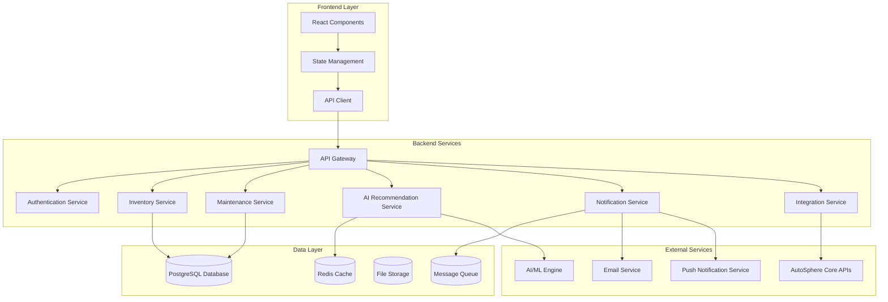

# Design Document: Vehicle Inventory Management System

## Overview

The Vehicle Inventory Management System is a comprehensive feature that extends the existing AutoSphere web application to provide users with professional-grade tools for managing vehicle-related inventory, tracking maintenance schedules, and receiving AI-powered recommendations. The system integrates seamlessly with AutoSphere's existing authentication, vehicle marketplace, and appointment booking infrastructure.

The design follows a modular, event-driven architecture that supports real-time notifications, multi-vehicle management, and scalable AI recommendation processing. The system is built to handle both individual vehicle owners and professional users managing multiple vehicles.

## Architecture

### High-Level Architecture

The system follows a layered architecture pattern with clear separation of concerns:



### Service Architecture

**Microservices Approach**: Each major functional area is implemented as a separate service with well-defined APIs and responsibilities.

**Event-Driven Communication**: Services communicate through events for loose coupling and scalability.

**Caching Strategy**: Redis cache for frequently accessed data like AI recommendations and user preferences.

**Message Queue**: Asynchronous processing for notifications, AI analysis, and maintenance calculations.

## Components and Interfaces

### Frontend Components

#### Core UI Components

**InventoryDashboard**
- Main dashboard showing inventory overview across all vehicles
- Filters and search functionality
- Quick action buttons for common tasks

**VehicleInventoryView**
- Vehicle-specific inventory display
- Drag-and-drop item management
- Integration with maintenance tracking

**InventoryItemForm**
- Add/edit inventory items
- Category selection and validation
- Vehicle association management

**MaintenanceTracker**
- Visual maintenance schedule display
- Due/overdue item highlighting
- Integration with appointment booking

**NotificationCenter**
- Real-time notification display
- Notification preferences management
- Action buttons for quick responses

**AIRecommendationPanel**
- Personalized recommendations display
- Recommendation explanations
- Integration with marketplace

#### State Management

```typescript
interface InventoryState {
  vehicles: Vehicle[]
  inventoryItems: InventoryItem[]
  maintenanceSchedules: MaintenanceSchedule[]
  notifications: Notification[]
  aiRecommendations: AIRecommendation[]
  filters: FilterState
  loading: LoadingState
  errors: ErrorState
}
```

### Backend Services

#### Inventory Service

**Core Responsibilities:**
- CRUD operations for inventory items
- Vehicle-inventory relationship management
- Search and filtering functionality
- Stock level monitoring

**Key APIs:**
```typescript
interface InventoryService {
  createItem(item: CreateInventoryItemRequest): Promise<InventoryItem>
  updateItem(id: string, updates: UpdateInventoryItemRequest): Promise<InventoryItem>
  deleteItem(id: string): Promise<void>
  getItemsByVehicle(vehicleId: string): Promise<InventoryItem[]>
  searchItems(query: SearchQuery): Promise<InventoryItem[]>
  checkStockLevels(vehicleId: string): Promise<StockAlert[]>
}
```

#### Maintenance Service

**Core Responsibilities:**
- Maintenance schedule calculation
- Due date tracking and alerts
- Maintenance history management
- Integration with vehicle data

**Key APIs:**
```typescript
interface MaintenanceService {
  createSchedule(schedule: CreateMaintenanceScheduleRequest): Promise<MaintenanceSchedule>
  updateSchedule(id: string, updates: UpdateScheduleRequest): Promise<MaintenanceSchedule>
  getSchedulesByVehicle(vehicleId: string): Promise<MaintenanceSchedule[]>
  calculateDueDates(vehicleId: string, currentMileage: number): Promise<MaintenanceItem[]>
  recordMaintenance(record: MaintenanceRecord): Promise<void>
}
```

#### AI Recommendation Service

**Core Responsibilities:**
- Generate personalized recommendations
- Analyze inventory and maintenance patterns
- Integration with external AI/ML services
- Recommendation scoring and ranking

**Key APIs:**
```typescript
interface AIRecommendationService {
  generateRecommendations(userId: string, vehicleId?: string): Promise<AIRecommendation[]>
  analyzeMaintenancePatterns(vehicleId: string): Promise<MaintenanceAnalysis>
  scoreRecommendation(recommendation: AIRecommendation): Promise<number>
  trackRecommendationOutcome(recommendationId: string, outcome: RecommendationOutcome): Promise<void>
}
```

#### Notification Service

**Core Responsibilities:**
- Real-time notification delivery
- Notification preference management
- Multi-channel notification support
- Notification batching and throttling

**Key APIs:**
```typescript
interface NotificationService {
  sendNotification(notification: NotificationRequest): Promise<void>
  scheduleNotification(notification: ScheduledNotificationRequest): Promise<string>
  updatePreferences(userId: string, preferences: NotificationPreferences): Promise<void>
  getNotificationHistory(userId: string): Promise<Notification[]>
  markAsRead(notificationId: string): Promise<void>
}
```

## Data Models

### Core Entities

#### Vehicle
```typescript
interface Vehicle {
  id: string
  userId: string
  make: string
  model: string
  year: number
  vin?: string
  currentMileage: number
  purchaseDate?: Date
  createdAt: Date
  updatedAt: Date
}
```

#### InventoryItem
```typescript
interface InventoryItem {
  id: string
  vehicleId: string
  name: string
  category: InventoryCategory
  quantity: number
  minStockLevel?: number
  unitPrice?: number
  purchaseDate?: Date
  expirationDate?: Date
  location?: string
  notes?: string
  imageUrls: string[]
  createdAt: Date
  updatedAt: Date
}

enum InventoryCategory {
  PARTS = 'parts',
  ACCESSORIES = 'accessories',
  DOCUMENTS = 'documents',
  FLUIDS = 'fluids',
  TOOLS = 'tools'
}
```

#### MaintenanceSchedule
```typescript
interface MaintenanceSchedule {
  id: string
  vehicleId: string
  itemName: string
  scheduleType: ScheduleType
  intervalMiles?: number
  intervalMonths?: number
  lastServiceMileage?: number
  lastServiceDate?: Date
  nextDueMileage?: number
  nextDueDate?: Date
  priority: MaintenancePriority
  estimatedCost?: number
  relatedInventoryItems: string[]
  createdAt: Date
  updatedAt: Date
}

enum ScheduleType {
  MILEAGE_BASED = 'mileage_based',
  TIME_BASED = 'time_based',
  COMBINED = 'combined'
}

enum MaintenancePriority {
  LOW = 'low',
  MEDIUM = 'medium',
  HIGH = 'high',
  CRITICAL = 'critical'
}
```

#### AIRecommendation
```typescript
interface AIRecommendation {
  id: string
  userId: string
  vehicleId?: string
  type: RecommendationType
  title: string
  description: string
  reasoning: string
  confidence: number
  priority: number
  estimatedCost?: number
  relatedItems: string[]
  actionUrl?: string
  expiresAt?: Date
  createdAt: Date
}

enum RecommendationType {
  PART_REPLACEMENT = 'part_replacement',
  MAINTENANCE_SERVICE = 'maintenance_service',
  INVENTORY_RESTOCK = 'inventory_restock',
  COST_OPTIMIZATION = 'cost_optimization'
}
```

#### Notification
```typescript
interface Notification {
  id: string
  userId: string
  type: NotificationType
  title: string
  message: string
  priority: NotificationPriority
  channels: NotificationChannel[]
  relatedEntityId?: string
  relatedEntityType?: string
  actionUrl?: string
  isRead: boolean
  scheduledFor?: Date
  sentAt?: Date
  createdAt: Date
}

enum NotificationType {
  LOW_STOCK = 'low_stock',
  MAINTENANCE_DUE = 'maintenance_due',
  DOCUMENT_EXPIRING = 'document_expiring',
  AI_RECOMMENDATION = 'ai_recommendation',
  APPOINTMENT_REMINDER = 'appointment_reminder'
}

enum NotificationChannel {
  IN_APP = 'in_app',
  EMAIL = 'email',
  PUSH = 'push',
  SMS = 'sms'
}
```

### Database Schema

#### Relationships
- User (1) → (N) Vehicle
- Vehicle (1) → (N) InventoryItem
- Vehicle (1) → (N) MaintenanceSchedule
- User (1) → (N) Notification
- User (1) → (N) AIRecommendation
- MaintenanceSchedule (N) → (N) InventoryItem (through junction table)

#### Indexes
- `inventory_items(vehicle_id, category)`
- `maintenance_schedules(vehicle_id, next_due_date)`
- `notifications(user_id, created_at, is_read)`
- `ai_recommendations(user_id, vehicle_id, created_at)`

## Error Handling

### Error Categories

**Validation Errors**
- Invalid input data
- Business rule violations
- Constraint violations

**Authentication/Authorization Errors**
- Invalid credentials
- Insufficient permissions
- Expired tokens

**External Service Errors**
- AI service unavailable
- Email service failures
- AutoSphere API errors

**System Errors**
- Database connection failures
- File storage errors
- Network timeouts

### Error Response Format

```typescript
interface ErrorResponse {
  error: {
    code: string
    message: string
    details?: Record<string, any>
    timestamp: string
    requestId: string
  }
}
```

### Error Handling Strategy

**Frontend Error Handling:**
- Global error boundary for React components
- Toast notifications for user-facing errors
- Retry mechanisms for transient failures
- Graceful degradation for non-critical features

**Backend Error Handling:**
- Structured error logging with correlation IDs
- Circuit breaker pattern for external services
- Exponential backoff for retries
- Dead letter queues for failed message processing

## Testing Strategy

The testing strategy employs a dual approach combining unit tests for specific scenarios and property-based tests for comprehensive validation of universal properties.

### Unit Testing Approach

Unit tests focus on:
- **Specific examples**: Concrete scenarios that demonstrate correct behavior
- **Edge cases**: Boundary conditions and unusual inputs
- **Error conditions**: Invalid inputs and failure scenarios
- **Integration points**: Component interactions and API contracts

### Property-Based Testing Approach

Property-based tests validate universal properties across randomized inputs with minimum 100 iterations per test. Each test references its corresponding design property using the tag format: **Feature: vehicle-inventory-management, Property {number}: {property_text}**

### Testing Framework Selection

**Frontend Testing:**
- Jest for unit testing
- React Testing Library for component testing
- fast-check for property-based testing in TypeScript

**Backend Testing:**
- Jest for unit testing
- Supertest for API testing
- fast-check for property-based testing

### Test Configuration

- Minimum 100 iterations for all property-based tests
- Automated test execution in CI/CD pipeline
- Code coverage targets: 80% for unit tests, 100% property coverage
- Integration tests for critical user flows

## Correctness Properties

*A property is a characteristic or behavior that should hold true across all valid executions of a system—essentially, a formal statement about what the system should do. Properties serve as the bridge between human-readable specifications and machine-verifiable correctness guarantees.*

Based on the prework analysis of acceptance criteria, the following properties validate the system's correctness across all valid inputs:

### Property 1: Inventory Display Grouping
*For any* user with multiple vehicles and inventory items, the system should display inventory items correctly grouped by their associated vehicle, with each item appearing only under its assigned vehicle.
**Validates: Requirements 1.1, 2.1**

### Property 2: Required Field Validation
*For any* inventory item creation request, the system should reject items that are missing required fields (name, category, quantity, vehicle association) and accept items that have all required fields.
**Validates: Requirements 1.2, 3.1**

### Property 3: Data Persistence Consistency
*For any* inventory item update operation, the system should save all changes to the database and update the last modified timestamp to reflect the current time.
**Validates: Requirements 1.3**

### Property 4: Deletion Completeness
*For any* inventory item deletion, the item should be completely removed from both the database and all display interfaces, with no traces remaining.
**Validates: Requirements 1.4**

### Property 5: Search Result Accuracy
*For any* search query, all returned inventory items should match the search criteria (item name, category, or vehicle), and no non-matching items should be included in results.
**Validates: Requirements 1.5**

### Property 6: Category Validation
*For any* inventory item, the system should only accept items with valid categories (parts, accessories, documents, fluids, tools) and reject items with invalid categories.
**Validates: Requirements 1.6**

### Property 7: Display Information Completeness
*For any* inventory item display, all required fields (name, category, quantity, purchase date, associated vehicle) should be present and visible to the user.
**Validates: Requirements 1.7**

### Property 8: Vehicle Inventory Isolation
*For any* user with multiple vehicles, inventory items should be properly isolated per vehicle, with no cross-contamination between vehicle inventories.
**Validates: Requirements 2.2**

### Property 9: Vehicle Filtering Accuracy
*For any* vehicle selection, the system should display only inventory items associated with the selected vehicle, filtering out all items from other vehicles.
**Validates: Requirements 2.3**

### Property 10: Vehicle Association Display
*For any* inventory item in an all-vehicles view, the associated vehicle information should be clearly displayed and correctly identify the owning vehicle.
**Validates: Requirements 2.4**

### Property 11: Multi-Vehicle Scalability
*For any* reasonable number of vehicles (up to 100), the system should handle vehicle creation, inventory management, and display operations without performance degradation or data corruption.
**Validates: Requirements 2.5**

### Property 12: Vehicle Deletion Handling
*For any* vehicle deletion operation, the system should handle associated inventory items according to the user's specified preference (delete, transfer, or archive).
**Validates: Requirements 2.6**

### Property 13: Vehicle Association Transfer
*For any* inventory item transfer between vehicles, the system should update the vehicle association correctly and maintain data integrity.
**Validates: Requirements 3.3**

### Property 14: Referential Integrity Enforcement
*For any* attempt to create orphaned inventory items or violate vehicle-inventory relationships, the system should prevent the operation and maintain referential integrity.
**Validates: Requirements 3.4, 3.6**

### Property 15: Vehicle Profile Inventory Display
*For any* vehicle profile view, all inventory items associated with that vehicle should be displayed, and no items from other vehicles should appear.
**Validates: Requirements 3.5**

### Property 16: Maintenance Date Calculation
*For any* maintenance schedule with defined intervals, the system should calculate replacement dates correctly based on mileage or time intervals from the last service.
**Validates: Requirements 4.1**

### Property 17: Maintenance Status Updates
*For any* maintenance item that becomes due based on current date or mileage, the system should automatically mark it as requiring attention.
**Validates: Requirements 4.2**

### Property 18: Maintenance Completion Processing
*For any* completed maintenance action, the system should update the maintenance record, reset the next due date based on the schedule, and maintain accurate history.
**Validates: Requirements 4.3, 4.4**

### Property 19: Maintenance Status Categorization
*For any* set of maintenance items with different due dates, the system should correctly categorize them as overdue, due soon, or upcoming based on current date and mileage.
**Validates: Requirements 4.5**

### Property 20: Maintenance Schedule Type Support
*For any* maintenance schedule, the system should correctly handle both mileage-based and time-based scheduling, calculating due dates appropriately for each type.
**Validates: Requirements 4.6**

### Property 21: AI Recommendation Generation
*For any* user with inventory and vehicle data, the AI system should generate personalized recommendations that are relevant to the user's specific situation.
**Validates: Requirements 5.1**

### Property 22: Recommendation Information Completeness
*For any* AI recommendation, the system should provide complete information including suggested action, explanation, and reasoning for the recommendation.
**Validates: Requirements 5.2, 5.3**

### Property 23: Recommendation Update Responsiveness
*For any* change to inventory, maintenance records, or vehicle usage, the system should update recommendations to reflect the new data state.
**Validates: Requirements 5.4**

### Property 24: Recommendation Tracking
*For any* user action on a recommendation, the system should track the action and its outcome for effectiveness analysis.
**Validates: Requirements 5.5**

### Property 25: Marketplace Integration
*For any* AI recommendation for parts or services, the system should include relevant marketplace integration data when available.
**Validates: Requirements 5.6**

### Property 26: Recommendation Input Consideration
*For any* recommendation generation, the system should consider all relevant factors including vehicle age, mileage, maintenance history, and current inventory levels.
**Validates: Requirements 5.7**

### Property 27: Stock Threshold Notifications
*For any* inventory item that falls below its user-defined minimum stock level, the system should send appropriate low stock notifications.
**Validates: Requirements 6.1**

### Property 28: Document Expiration Warnings
*For any* document with an expiration date, the system should send warnings at appropriate intervals before the expiration date.
**Validates: Requirements 6.2**

### Property 29: Maintenance Due Notifications
*For any* maintenance item that becomes due or overdue, the system should send timely maintenance reminder notifications.
**Validates: Requirements 6.3**

### Property 30: Notification Preference Compliance
*For any* user notification preferences and thresholds, the system should respect these settings when sending notifications.
**Validates: Requirements 6.4**

### Property 31: Multi-Channel Notification Delivery
*For any* notification configured for multiple channels, the system should deliver the notification through all specified channels (in-app, email, push).
**Validates: Requirements 6.5**

### Property 32: Notification Grouping
*For any* set of related notifications generated within a short time period, the system should group them appropriately to prevent notification fatigue.
**Validates: Requirements 6.6**

### Property 33: Notification Status Management
*For any* notification trigger that is addressed by user action, the system should automatically clear or update the notification status appropriately.
**Validates: Requirements 6.7**

### Property 34: Document Storage and Association
*For any* document upload, the system should store the document securely and correctly associate it with the specified vehicle.
**Validates: Requirements 7.1**

### Property 35: Document Type Support
*For any* common document type (registration, insurance, warranties, service records), the system should accept and properly categorize the document.
**Validates: Requirements 7.3**

### Property 36: Document Display Completeness
*For any* document display, the system should show all required information including document type, expiration status, and upload date.
**Validates: Requirements 7.4**

### Property 37: Document Retrieval
*For any* stored document, users should be able to download and view the document successfully.
**Validates: Requirements 7.5**

### Property 38: Document Expiration Handling
*For any* document that has passed its expiration date, the system should mark it as expired and prompt for renewal.
**Validates: Requirements 7.6**

### Property 39: Document Version History
*For any* document that is updated with a new version, the system should maintain the version history while making the new version current.
**Validates: Requirements 7.7**

### Property 40: Appointment Rescheduling Options
*For any* existing appointment, the system should provide functional options to reschedule or modify the appointment.
**Validates: Requirements 8.1**

### Property 41: Appointment Rescheduling Processing
*For any* appointment rescheduling request, the system should check service provider availability and update the booking accordingly.
**Validates: Requirements 8.2**

### Property 42: Inventory-Appointment Integration
*For any* appointment booking, the system should consider relevant inventory data when suggesting services or parts to bring.
**Validates: Requirements 8.3, 8.4**

### Property 43: Appointment System Synchronization
*For any* appointment change made in the inventory system, the change should be properly synchronized with the existing AutoSphere appointment system.
**Validates: Requirements 8.5**

### Property 44: Appointment-Inventory Linking
*For any* appointment related to specific inventory items, the system should establish and maintain proper links between the appointment and relevant parts or maintenance records.
**Validates: Requirements 8.6**

### Property 45: Appointment Confirmation Notifications
*For any* rescheduled appointment, the system should send appropriate confirmation notifications to the user.
**Validates: Requirements 8.7**

### Property 46: Authentication Integration
*For any* user attempting to access the inventory system, authentication should work seamlessly with the existing AutoSphere authentication system.
**Validates: Requirements 9.2**

### Property 47: Authorization Enforcement
*For any* attempt to access inventory data, the system should verify user permissions and vehicle ownership before granting access.
**Validates: Requirements 9.3**

### Property 48: Audit Logging
*For any* inventory or maintenance data change, the system should create appropriate audit log entries with sufficient detail for tracking.
**Validates: Requirements 9.4**

### Property 49: Account Deletion Data Cleanup
*For any* user account deletion, all associated inventory data should be securely removed from the system.
**Validates: Requirements 9.6**

### Property 50: Maintenance Cost Reporting
*For any* user with maintenance history, the system should generate accurate cost reports showing expenses over specified time periods.
**Validates: Requirements 10.1**

### Property 51: Inventory Usage Analytics
*For any* user with inventory usage history, the system should provide accurate analytics showing consumption patterns and trends.
**Validates: Requirements 10.2**

### Property 52: Report Filtering Functionality
*For any* report generation request with filters, the system should apply the filters correctly and display only relevant data for the specified criteria.
**Validates: Requirements 10.3**

### Property 53: Maintenance Efficiency Metrics
*For any* user with sufficient maintenance data, the system should calculate and display meaningful maintenance efficiency metrics.
**Validates: Requirements 10.4**

### Property 54: Maintenance Cost Comparisons
*For any* maintenance scenarios with sufficient data, the system should provide accurate cost comparisons between different maintenance approaches.
**Validates: Requirements 10.5**

### Property 55: Report Export Functionality
*For any* generated report, the system should successfully export the report in the requested format (PDF or CSV) with all data intact.
**Validates: Requirements 10.7**