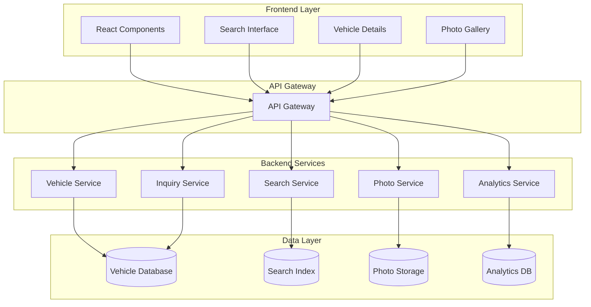

# Design Document: Vehicle Marketplace

## Overview

The Vehicle Marketplace is the core feature of AutoSphere that enables a comprehensive vehicle buying and selling experience. The system provides dealers with powerful listing management tools while offering users intuitive search, discovery, and inquiry capabilities. The architecture emphasizes scalability, performance, and user experience.

## Architecture

The Vehicle Marketplace follows a microservices architecture with clear separation of concerns:



## Components and Interfaces

### Vehicle Service
**Responsibilities:**
- CRUD operations for vehicle listings
- Data validation and business rules
- Status management (active, sold, pending)
- Version history tracking

**Key Interfaces:**
```typescript
interface VehicleService {
  createListing(dealerId: string, vehicleData: VehicleData): Promise<VehicleListing>
  updateListing(listingId: string, updates: Partial<VehicleData>): Promise<VehicleListing>
  deleteListing(listingId: string): Promise<void>
  getListingById(listingId: string): Promise<VehicleListing>
  getListingsByDealer(dealerId: string): Promise<VehicleListing[]>
  markAsSold(listingId: string): Promise<void>
}
```

### Search Service
**Responsibilities:**
- Full-text search across vehicle listings
- Advanced filtering and sorting
- Search result ranking and relevance
- Search analytics and optimization

**Key Interfaces:**
```typescript
interface SearchService {
  searchVehicles(query: SearchQuery): Promise<SearchResults>
  getFilters(): Promise<FilterOptions>
  getSuggestions(query: string): Promise<string[]>
  trackSearch(query: SearchQuery, results: SearchResults): Promise<void>
}
```

### Photo Service
**Responsibilities:**
- Image upload and storage
- Image optimization and resizing
- Gallery management
- CDN integration for fast delivery

**Key Interfaces:**
```typescript
interface PhotoService {
  uploadPhotos(listingId: string, photos: File[]): Promise<PhotoMetadata[]>
  deletePhoto(photoId: string): Promise<void>
  reorderPhotos(listingId: string, photoOrder: string[]): Promise<void>
  setPrimaryPhoto(listingId: string, photoId: string): Promise<void>
  getPhotos(listingId: string): Promise<PhotoMetadata[]>
}
```

### Inquiry Service
**Responsibilities:**
- Managing user inquiries about vehicles
- Notification delivery (email, in-app)
- Inquiry tracking and status management
- Communication history

**Key Interfaces:**
```typescript
interface InquiryService {
  submitInquiry(inquiry: InquiryData): Promise<Inquiry>
  getInquiriesForListing(listingId: string): Promise<Inquiry[]>
  getInquiriesForDealer(dealerId: string): Promise<Inquiry[]>
  respondToInquiry(inquiryId: string, response: string): Promise<void>
  markInquiryAsRead(inquiryId: string): Promise<void>
}
```

## Data Models

### Vehicle Listing
```typescript
interface VehicleListing {
  id: string
  dealerId: string
  vin: string
  make: string
  model: string
  year: number
  price: number
  mileage: number
  condition: 'new' | 'used' | 'certified'
  bodyType: string
  fuelType: string
  transmission: string
  drivetrain: string
  exteriorColor: string
  interiorColor: string
  features: string[]
  description: string
  photos: PhotoMetadata[]
  status: 'active' | 'sold' | 'pending' | 'draft'
  location: Location
  createdAt: Date
  updatedAt: Date
  viewCount: number
  inquiryCount: number
}
```

### Search Query
```typescript
interface SearchQuery {
  query?: string
  filters: {
    make?: string[]
    model?: string[]
    yearRange?: [number, number]
    priceRange?: [number, number]
    mileageRange?: [number, number]
    condition?: string[]
    bodyType?: string[]
    fuelType?: string[]
    location?: LocationFilter
  }
  sort: {
    field: 'price' | 'year' | 'mileage' | 'createdAt'
    direction: 'asc' | 'desc'
  }
  pagination: {
    page: number
    limit: number
  }
}
```

### Photo Metadata
```typescript
interface PhotoMetadata {
  id: string
  listingId: string
  url: string
  thumbnailUrl: string
  altText: string
  order: number
  isPrimary: boolean
  uploadedAt: Date
  fileSize: number
  dimensions: {
    width: number
    height: number
  }
}
```

## Correctness Properties

*A property is a characteristic or behavior that should hold true across all valid executions of a system-essentially, a formal statement about what the system should do. Properties serve as the bridge between human-readable specifications and machine-verifiable correctness guarantees.*

### Property 1: Vehicle Listing Data Integrity
*For any* vehicle listing creation or update, all required fields must be validated and the listing must receive a unique identifier
**Validates: Requirements 1.1, 1.3**

### Property 2: Photo Upload and Optimization
*For any* photo upload operation, the system must store the original image and generate optimized versions for different display contexts
**Validates: Requirements 1.2, 5.2**

### Property 3: Search Result Relevance
*For any* search query, returned results must match the specified criteria and be ordered according to the requested sort parameters
**Validates: Requirements 2.1, 2.2, 2.4**

### Property 4: Sold Vehicle Exclusion
*For any* vehicle marked as sold, it must not appear in active search results but remain accessible via direct link for reference
**Validates: Requirements 1.5**

### Property 5: Complete Vehicle Details Display
*For any* vehicle detail page, all available vehicle information including specifications, photos, and dealer contact information must be displayed
**Validates: Requirements 3.1, 3.4**

### Property 6: Inquiry Delivery and Tracking
*For any* submitted inquiry, it must be delivered to the correct dealer with complete user information and tracked for status updates
**Validates: Requirements 4.1, 4.5**

### Property 7: Photo Management Operations
*For any* photo management operation (upload, delete, reorder), the changes must be reflected in both storage and listing display
**Validates: Requirements 5.1, 5.3, 5.5**

### Property 8: Favorites Persistence and Status Updates
*For any* vehicle added to favorites, it must be saved to the user's list and reflect current availability status when viewed
**Validates: Requirements 6.1, 6.2**

### Property 9: Vehicle Comparison Accuracy
*For any* vehicles selected for comparison, the system must display accurate side-by-side specifications and features
**Validates: Requirements 6.3**

### Property 10: Analytics Data Accuracy
*For any* user interaction with vehicle listings, the system must accurately track and aggregate metrics for analytics reporting
**Validates: Requirements 7.1, 7.2**

### Property 11: Data Validation and Quality Control
*For any* vehicle listing submission, the system must validate VIN format, year consistency, and detect potential duplicates
**Validates: Requirements 8.1, 8.3**

### Property 12: Audit Trail Maintenance
*For any* vehicle data modification, the system must maintain complete audit trails and data integrity
**Validates: Requirements 1.4, 8.5**

## Error Handling

### Input Validation Errors
- **Invalid VIN Format**: Return specific error message with format requirements
- **Missing Required Fields**: Highlight missing fields with clear error messages
- **Invalid Price Range**: Validate price is positive and within reasonable bounds
- **Unsupported Image Format**: Reject with list of supported formats

### System Errors
- **Database Connection Failures**: Implement retry logic with exponential backoff
- **Search Service Unavailable**: Fall back to basic database queries
- **Photo Upload Failures**: Provide clear error messages and retry options
- **External Service Timeouts**: Implement circuit breaker pattern

### User Experience Errors
- **No Search Results**: Display helpful suggestions and alternative searches
- **Slow Loading**: Implement progressive loading and skeleton screens
- **Network Issues**: Provide offline indicators and retry mechanisms

## Testing Strategy

### Unit Testing
- **Service Layer Testing**: Test individual service methods with mock dependencies
- **Data Validation Testing**: Verify all validation rules work correctly
- **Error Handling Testing**: Ensure proper error responses for various failure scenarios
- **Business Logic Testing**: Test complex operations like duplicate detection and pricing validation

### Property-Based Testing
- **Minimum 100 iterations** per property test to ensure comprehensive coverage
- **Universal Property Validation**: Each correctness property implemented as automated test
- **Data Generation**: Use property testing to generate diverse vehicle data combinations
- **Edge Case Discovery**: Let property tests discover unexpected edge cases

**Property Test Configuration:**
Each property test must reference its design document property and run with the tag format:
**Feature: vehicle-marketplace, Property {number}: {property_text}**

### Integration Testing
- **API Endpoint Testing**: Test complete request/response cycles
- **Database Integration**: Verify data persistence and retrieval
- **Search Integration**: Test search service with real data
- **Photo Upload Integration**: Test complete photo upload and optimization pipeline

### Performance Testing
- **Search Performance**: Ensure search results return within 500ms for typical queries
- **Photo Upload Performance**: Test concurrent photo uploads and optimization
- **Database Query Performance**: Optimize queries for large vehicle datasets
- **Load Testing**: Test system behavior under high concurrent user load

The testing strategy emphasizes both specific examples through unit tests and universal correctness through property-based testing, ensuring comprehensive validation of the Vehicle Marketplace functionality.